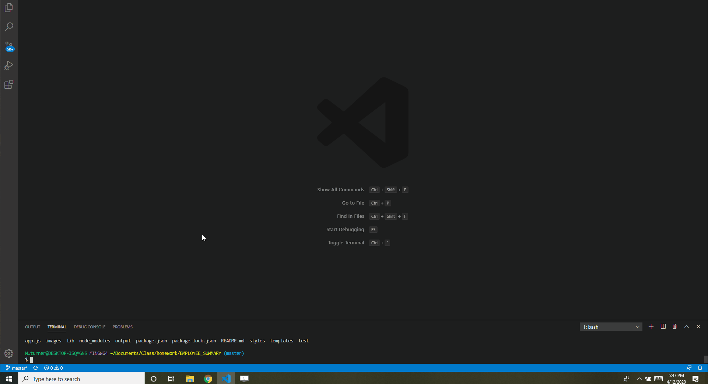

# EMPLOYEE_SUMMARY
###### Description

A simple Node CLI program to generate a team roster html page based on user input.

# Demo

## Table of Contents (Optional)
* [Top of Page](#description)
* [Gif](#description)
* [Installation](#installation)
* [Usage](#usage)
* [Credits](#credits)
* [License](#license)
* [Contributing](#contributing)
* [Tests](#tests)
* [Contacts](#contacts)

## Installation
1. Clone or Download this repository
2. On navigation to correct file install packages npm i

## Usage 
1. From command line type node index.js
2. Follow the prompts as requested entering team member information
3. When complete - open the "Outputs" directory for your html page

## Credits
Trilogy Schools for RenderHtml.js and test files    

## License
This project is licensed under The MIT License.

## Contributing
All contributions and suggestions are welcome! For direct contributions, please fork the repository and file a pull request.

## Tests
Tests written in test file.  Run NPM Run Test and see validation of various classes

## Contacts

* Name: Matt Turner (mwturner611)
* e-mail: mwturner611@gmail.com
* [LinkedIn](https://www.linkedin.com/in/matt-turner-ba328211a/)